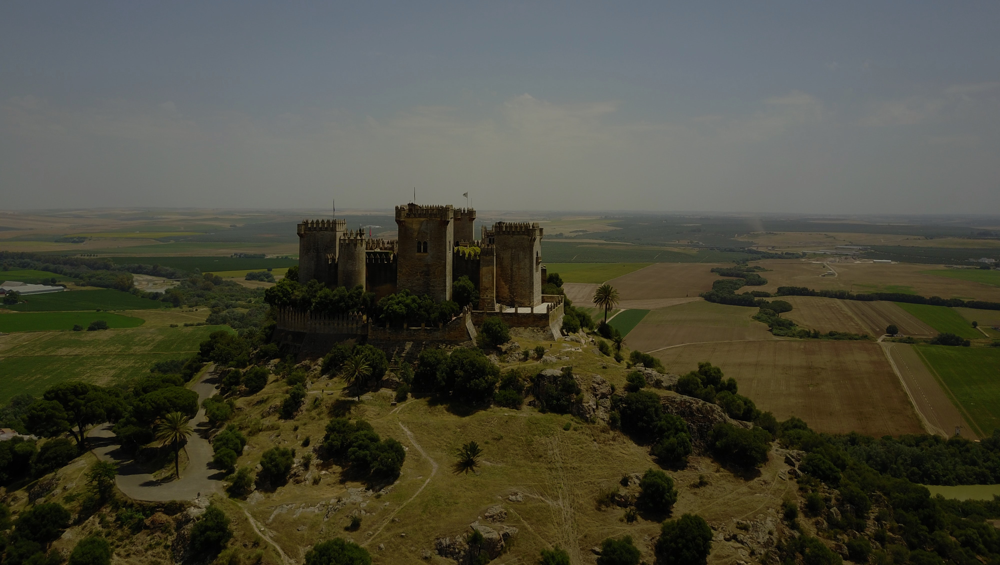

# Game of Thrones Weather

All images supplied by [Unsplash](https://unsplash.com).

| Temperature | Cloud Coverage                                                 |                                                                          |
|:-----------:|:--------------------------------------------------------------:|:------------------------------------------------------------------------:|
|             |                                                         >= 50% |                                                                     <50% |
| T<-10       |  Hardhome                   |  Craster's Keep           |
| -10<T<=0    |  The Wall                 |  Winterfell                       |
| 0<T<=10     |  The Erie                 |  The Iron Islands |
| 10<T<=20    |  Casterly Rock  |  King's Landing           |
| 20<T<=30    |  Highgarden             |  Sunspear                             |
| T>30        |  Tyrosh                         |  Qarth                                      | 